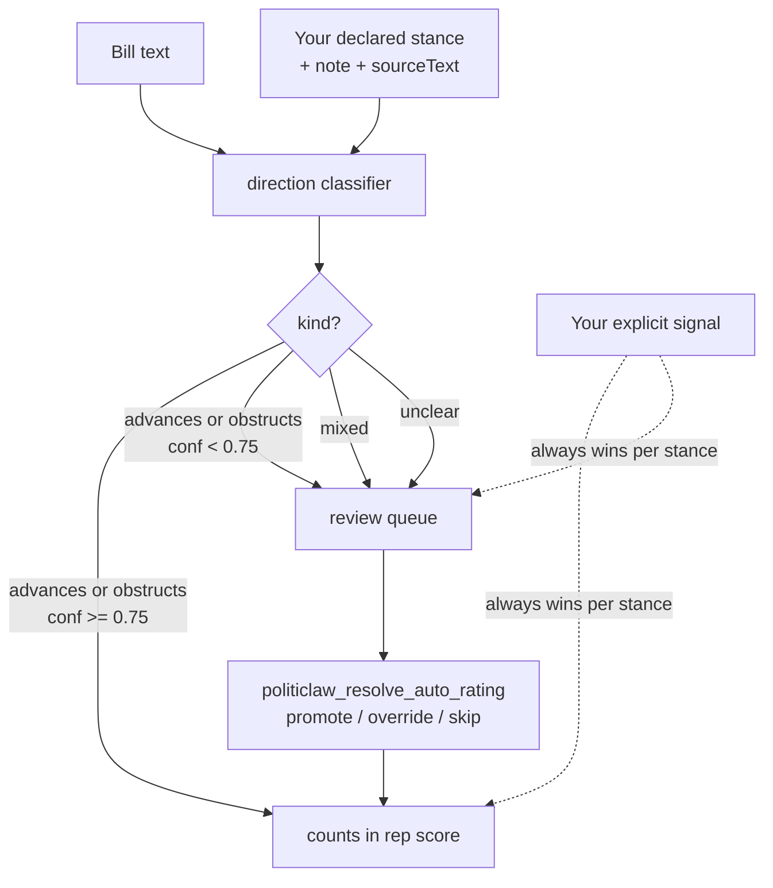

# Auto-Rated Bill Direction

Rep alignment scoring works by counting whether a representative's vote agreed with the position you'd have taken on each bill. Historically that position came only from an explicit `agree`/`disagree` signal you recorded per bill. The auto-direction feature is an opt-in path that lets PolitiClaw fill that signal in for bills you haven't manually rated, by asking a host LLM to classify whether the bill's text **advances** or **obstructs** each declared stance — with grounded-quote guardrails and explicit user disclosure.

The default mode is **off**, so existing setups behave exactly as before. The rest of this page is for users who want to turn it on.

## When to consider turning it on

You're a good fit if:

- You've declared at least one issue stance and want rep scoring to reflect more than the small handful of bills you've manually signaled.
- You want PolitiClaw to do work between explicit interactions but you still want every AI-derived rating disclosed and overrideable.
- You've thought about the privacy implication ([Privacy and Storage](./privacy-and-storage)): bill text plus your stance text (slug, note, sourceText) get sent to whichever LLM provider OpenClaw is configured with.

Skip it if:

- You want every rep-score input to be your own explicit judgment.
- Your OpenClaw host has no LLM provider configured — the feature degrades silently to "off" in that case anyway.

## How it works



- The classifier is the same module that the bill-scoring path uses ([`politiclaw_score_bill`](../reference/generated/tools/politiclaw_score_bill)). It's required to ground every directional claim in a literal quote from the bill's title, policy area, subjects, or summary; ungrounded claims are coerced to `unclear`.
- High-confidence (≥ 0.75) `advances` becomes an implied `agree`; high-confidence `obstructs` becomes an implied `disagree`. Lower-confidence calls, `mixed` calls, and `unclear` calls don't auto-count — they land in the review queue so you can decide.
- Your explicit `stance_signals` always win when present. The classifier only fills in for bills you haven't rated (and only under the modes that allow it).
- Classifier output is cached per `(bill, bill_update_date, stance_snapshot, stance_slug)`. Bill amendments and stance edits both invalidate the cache.

## Modes

Set with [`politiclaw_configure`](../reference/generated/tools/politiclaw_configure) (preference key `auto_direction_mode`).

| Mode | High-conf classifier | Mid-conf / mixed / unclear | Your explicit signal |
|---|---|---|---|
| `off` *(default)* | not run | not run | counts |
| `supplement` | counts only when no user signal exists | review queue | always wins |
| `co-equal` | counts; your signal overrides per-bill | review queue | overrides classifier |
| `advisory` | review queue (never auto-counts) | review queue | always counts |

`supplement` and `co-equal` produce the same rep-score math (user signals always preempt the classifier per bill); they're separated so future surfaces can present audit trails differently for "AI ran but you overrode" vs "AI never ran because you'd already signaled."

## Picking the model

OpenClaw is provider-agnostic — Anthropic, OpenAI, lmstudio, etc. By default the auto-direction feature uses whatever model OpenClaw resolves as the host's default for the active agent. If you want the classifier to use a cheaper model than your main agent (the prompt is heavily constrained — quote literal text, no outside knowledge — so a smaller model usually works fine), set `legislation_review_model`:

```
politiclaw_configure
  legislationReviewModel: "anthropic/claude-haiku-4-5"
```

Empty / unset means "use OpenClaw's default." The string is passed straight through to OpenClaw's provider resolver as `modelRef`.

If OpenClaw can't resolve a usable provider (no auth, no default model wired), the classifier silently behaves as if mode were `off` — your rep scores keep working, no calls fail loudly.

## The review loop

Two tools surface the human-in-the-loop flow:

- [`politiclaw_review_auto_ratings`](../reference/generated/tools/politiclaw_review_auto_ratings) lists pending bills filtered by `tier` (`borderline`, `mixed`, `unclassifiable`, or `all`). Each row shows the AI's call with confidence, the grounded quote, your existing signal (if any), and whether that signal applies to this stance only or is bill-level.
- [`politiclaw_resolve_auto_rating`](../reference/generated/tools/politiclaw_resolve_auto_rating) accepts `action ∈ {promote, override, skip}`:
  - **promote** requires `stanceSlug`. Copies the AI's call into a per-stance `stance_signals` row (advances → `agree`, obstructs → `disagree`). Errors on `mixed` / `unclear` since there's no single direction to accept.
  - **override** accepts an optional `stanceSlug`. With `stanceSlug` it scopes to a single stance; without it the override applies to every stance the bill matches (legacy bill-level signal shape).
  - **skip** is bill-level by design — "exclude this bill from rep scoring entirely."

Resolved rows are persisted to `stance_signals` with `source = 'review'` so the audit trail can distinguish human-in-the-loop AI review from spontaneous dashboard edits.

## Per-stance vs bill-level signals

A bill can advance one declared stance and obstruct another. Promote is per-stance for that reason: writing a bill-level signal in either direction would silently mis-apply across stances. The schema reflects this — `stance_signals.stance_slug` is nullable, and rep scoring resolves per `(bill, stance)` with the precedence:

1. Per-stance signal for this stance — wins
2. Bill-level signal — fills in for stances without a per-stance signal
3. Classifier output (per the user's mode) — fills in for stances with no signal of either kind

## How AI involvement shows up in output

- [`politiclaw_score_bill`](../reference/generated/tools/politiclaw_score_bill) renders `Direction against your stances [AI-rated]:` with confidence and the quoted passage when the classifier ran.
- [`politiclaw_score_representative`](../reference/generated/tools/politiclaw_score_representative) adds an `AI involvement: M of N counted votes were AI-rated; K came from your explicit signals.` footer when the classifier contributed at least one count.

The disclosure is the guardrail — every AI-derived contribution to a score is named in the score's own output, not buried in a settings panel.

## Caches and invalidation

- Bill amended → `bills.update_date` advances → next score query is a cache miss → re-classifies
- Any stance field edited (stance, weight, note, sourceText) → snapshot hash advances → next query is a cache miss
- Mode changes don't invalidate cached classifications (the rows are still valid for the bill); they only change whether those classifications participate in scoring

## Limits today

- Classification only runs through `politiclaw_score_bill`. Rep scoring reads cached classifications but doesn't trigger new ones, so bills you haven't scored manually (or via monitoring) won't surface in the auto-direction path until they have a `bill_direction` row.
- The model is whatever OpenClaw resolves at call time. Different runs may use different models if you change `legislation_review_model` between calls; cached rows record `model_id` for audit but the cache key doesn't include it.
- The feature is federal-only, matching the rest of PolitiClaw's coverage today. State and local bill text aren't classified.
