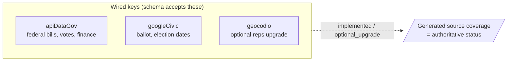

# Configuration

PolitiClaw's config schema declares exactly the named keys its runtime actually uses. For the keys themselves — what each unlocks, how to obtain them, how to set them, and what the gateway-restart implication is — see [API Keys](./api-keys).

Additional providers (state bills, state finance) are tracked on the plugin README as roadmap entries. Unknown legacy key strings may still validate for upgrade compatibility, but the runtime ignores them and the key-saving tools do not write them, so there is no "set this and hope" surface.

## Wired Keys

These keys are active in the current runtime:

- `plugins.entries.politiclaw.config.apiKeys.apiDataGov`
  - Required for the current federal bill, House roll-call vote, committee schedule, and FEC finance paths.
  - One key covers both api.congress.gov and FEC OpenFEC.
  - Senate roll-call votes use voteview.com (zero-key) and do not require this key.
- `plugins.entries.politiclaw.config.apiKeys.googleCivic`
  - Required for every ballot and election-logistics lookup today. Google Civic is the only wired ballot source.
- `plugins.entries.politiclaw.config.apiKeys.geocodio`
  - Optional upgrade for reps-by-address lookup when you want the API path instead of the zero-key local shapefile path.

## Source Of Truth

Use these generated pages whenever you need exact status:

- [Generated Config Schema](../reference/generated/config-schema)
- [Generated Source Coverage](../reference/generated/source-coverage)

## Practical Setup Order

For most users, the simplest order is:

1. Add `apiDataGov`.
2. Decide whether you need `googleCivic` for ballot workflows.
3. Decide whether you want `geocodio`, or whether the local shapefile path is enough.
4. Run `/politiclaw-doctor` after changing config.

For walkthroughs of how to save keys with [`politiclaw_configure`](../reference/generated/tools/politiclaw_configure) and what the gateway-restart side effect looks like, read [API Keys](./api-keys).
